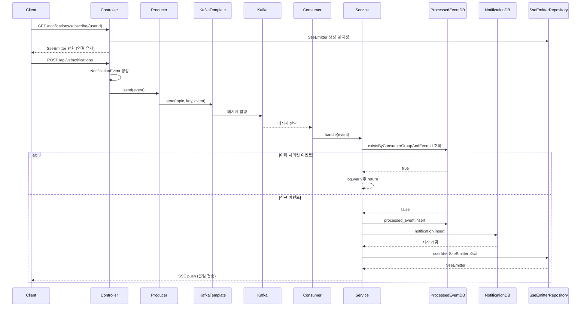

```mermaid
sequenceDiagram
    participant Client
    participant Controller
    participant Producer
    participant KafkaTemplate
    participant Kafka
    participant Consumer
    participant Service
    participant ProcessedEventDB
    participant NotificationDB
    participant SseEmitterRepository

    %% SSE 연결 수립
    Client->>Controller: GET /notifications/subscribe/{userId}
    Controller->>SseEmitterRepository: SseEmitter 생성 및 저장
    Controller-->>Client: SseEmitter 반환 (연결 유지)

    %% 알림 이벤트 발행
    Client->>Controller: POST /api/v1/notifications
    Controller->>Controller: NotificationEvent 생성
    Controller->>Producer: send(event)
    Producer->>KafkaTemplate: send(topic, key, event)
    KafkaTemplate->>Kafka: 메시지 발행

    %% 알림 이벤트 처리
    Kafka-->>Consumer: 메시지 전달
    Consumer->>Service: handle(event)

    Service->>ProcessedEventDB: existsByConsumerGroupAndEventId 조회
    alt 이미 처리된 이벤트
        ProcessedEventDB-->>Service: true
        Service-->>Service: log.warn 후 return
    else 신규 이벤트
        ProcessedEventDB-->>Service: false
        Service->>ProcessedEventDB: processed_event insert
        Service->>NotificationDB: notification insert
        NotificationDB-->>Service: 저장 성공
        Service->>SseEmitterRepository: userId로 SseEmitter 조회
        SseEmitterRepository-->>Service: SseEmitter
        Service-->>Client: SSE push (알림 전송)
    end
```
