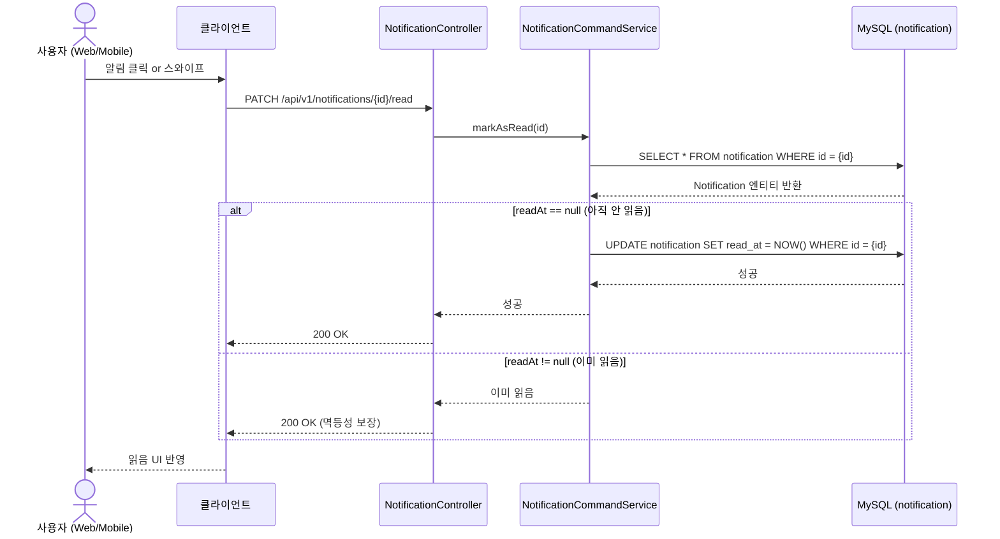

# 읽음 처리 플로우

## API
`PATCH /api/v1/notifications/{id}/read`

## Sequence Diagram

## 처리 규칙

- `read_at`이 `null`이면 → 현재 시각으로 업데이트
- `read_at`이 이미 있으면 → 그냥 200 반환 (중복 요청 허용)
- 본인 알림이 아닌 경우 → 403 Forbidden (추후 인증 연동 시 처리)

## 클라이언트 동작

읽음 처리는 클라이언트 단에서 선처리 함
